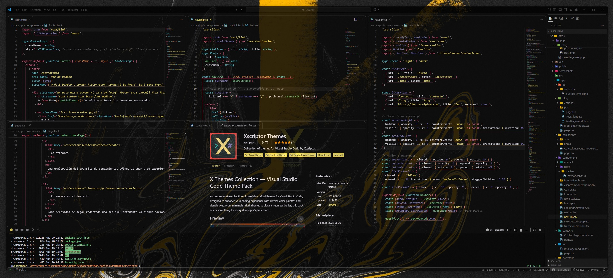
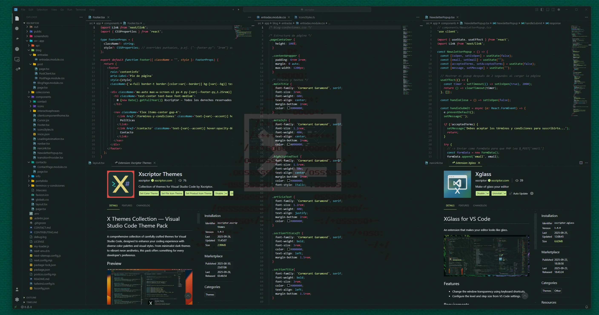
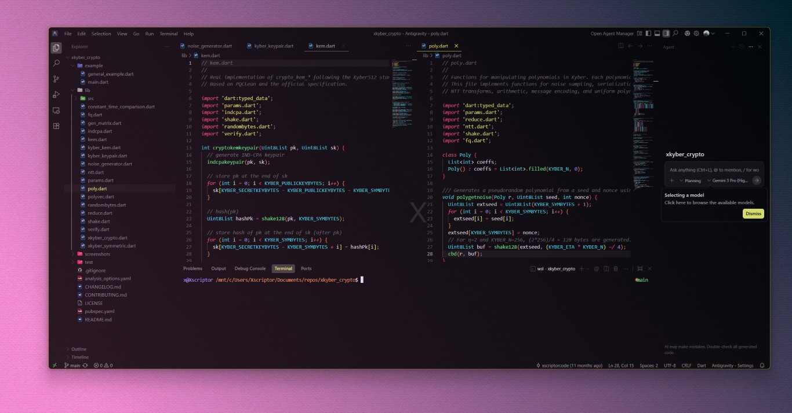
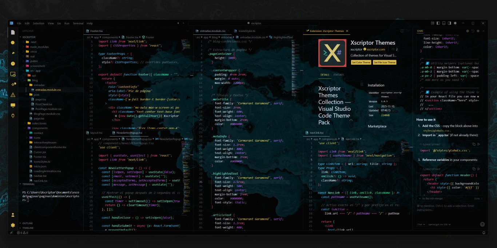

<h1 align="center">VSCode Xscriptor</h1>

Improve accessibility and customization in Visual Studio Code with the Xscriptor ecosystem — themes, icons, snippets, and lightweight UI tweaks.

## Structure

This repository contains several packages:

- `themes/` — Theme collections: `xscriptor-themes`, `x-dark-colors`.
- `extensions/` — `xglass` transparency UI extension.
- `snippets/` — Predefined code snippets for common stacks.
- `ui-mods/` — Small UI adjustments and customizations.
- `assets/` — Screenshots, previews, and branding.

## Previews

    
    
    
    

## Install

- Marketplace: search for `Xscriptor` in the Extensions view to install themes and `Xglass`.
- From source: open a package folder in VS Code and use `F5` (Run Extension) or install a built `.vsix` via `Extensions: Install from VSIX`.

## Usage

- Color Theme: open `Preferences → Color Theme` and select any Xscriptor theme (e.g., Dark Xscriptor, X Dark Colors).
- Icon Theme: open `Preferences → File Icon Theme` and choose an Xscriptor icon set.
- Xglass: run commands `xglass: Enable Transparency Mode`, `+ transparency`, `- transparency`, or configure `xglass.alpha` and `xglass.step` in `Settings`.

## Compatibility

Extensions and themes are compatible with `VS Code`, `VS Code Insiders`, and forks of VS Code such as `VSCodium`, `Code - OSS`, `OpenVSCode Server`, `code-server`, `Cursor`, `Void Editor`, `Antigravity`, and `Trae`.

## Development

- Each package is a standalone VS Code extension folder.
- Use the `Run and Debug` panel to launch an Extension Development Host.
- Place screenshots under `assets/` and reference them in the Previews section.

## Contributing

Issues and pull requests are welcome. Please open tickets for bugs or requests in the repository issues.

## License

MIT License. See `LICENSE` in each package.

